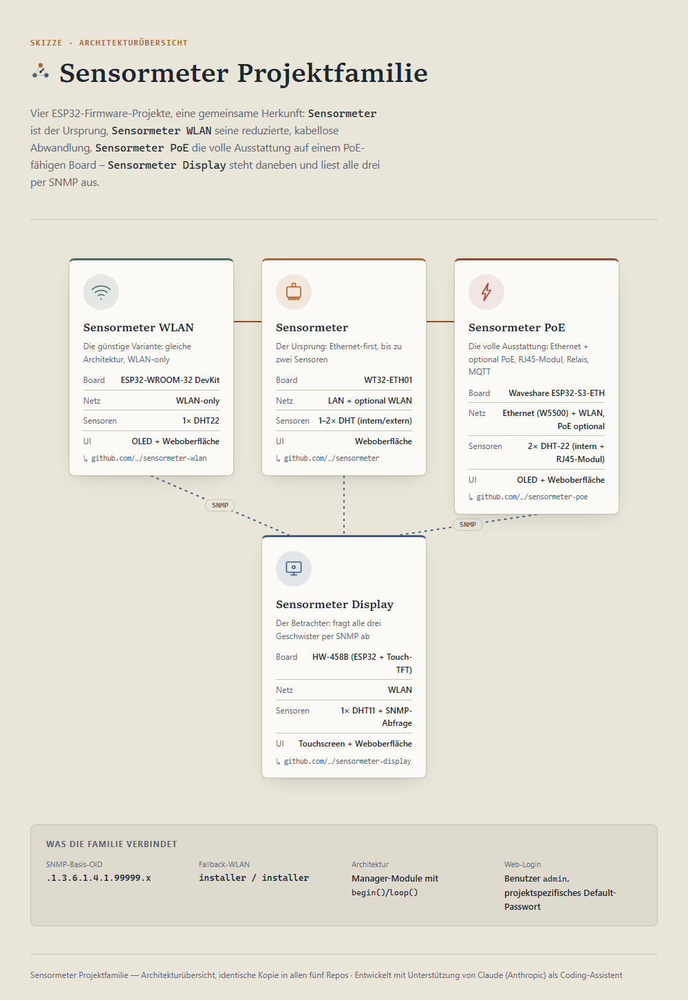

# Sensormeter Display (HW-458B)

<picture>
  <source media="(prefers-color-scheme: dark)" srcset="docs/projektfamilie-dark.png">
  <source media="(prefers-color-scheme: light)" srcset="docs/projektfamilie-light.png">
  
</picture>

ESP32-basiertes 2,8"-Touchdisplay-System (Board HW-458B: ESP-WROOM-32 +
ST7789P3 TFT, 240x320, resistiver 4-Draht-Touch). Zeigt wahlweise
Innenraumklima (DHT11), Uhrzeit/Datum, Messwerte des
[Sensormeter](https://github.com/peterhagelhof7-cmd/sensormeter)-Projekts
(SNMP) oder Ping-Laufzeiten an. WLAN-Konfiguration und Bedienung direkt am
Gerät per Touch, keine Cloud-Anbindung. Zusätzlich ein öffentliches,
nicht passwortgeschütztes Status-Dashboard sowie ein passwortgeschützter
Einstellungs-Webserver (Systemname, Betriebsmodus, Ping-/Sensormeter-Ziele,
Warnschwellwerte, DHT11-Kalibrierkorrektur) inkl. lokalem OTA-Update per
`.bin`-Upload.

[**One-Pager (PDF)**](docs/sensormeter-display-onepager.pdf) — kompakte Projektübersicht auf einer Seite.

## Dokumentation

| Datei | Inhalt |
|---|---|
| [docs/systemuebersicht.pdf](docs/systemuebersicht.pdf) | Familienweite Systemübersicht: Funktionsumfang, Zusammenspiel, Zabbix-Anbindung aller vier Projekte (identisch in allen vier Repos) |
| [docs/sensormeter-display-onepager.pdf](docs/sensormeter-display-onepager.pdf) | One-Pager: Projektübersicht, Architektur, Kennzahlen auf einer Seite |
| [docs/admin-guide.pdf](docs/admin-guide.pdf) | Admin-Guide: Inbetriebnahme, Touch-Bedienung, Konfiguration über die Weboberfläche |
| [docs/projektfamilie.html](docs/projektfamilie.html) | Architekturskizze: wie die vier Sensormeter-Projekte zusammenhängen |
| [docs/lastenheft.txt](docs/lastenheft.txt) | Fachliche Anforderungen: Hardware, GUI, Betriebsarten, Datenquellen, Fehlerbehandlung, Webserver-Nachtrag |
| [docs/pflichtenheft.txt](docs/pflichtenheft.txt) | Technische Umsetzung: alle Softwaremodule, NVS-/LittleFS-Datenspeicherung, Startup-Flow, Fehlerbehandlung, Nebenläufigkeit |
| [docs/verdrahtungsplan.html](docs/verdrahtungsplan.html) | Interaktiver Verdrahtungsplan (TFT/Touch/RGB-LED onboard, DHT11 extern) - Klick auf einen Draht im Schema hebt ihn hervor und zeigt Start-/Zielpin |
| [docs/implementierungsplan.html](docs/implementierungsplan.html) | Visueller Implementierungsplan P0–P8 (lokal im Browser öffnen) |
| [docs/entscheidungen.md](docs/entscheidungen.md) | Entscheidungsprotokoll: Pinbelegung, Touch-Ansteuerung, Mutex-Fix, Partitionstabelle, Warnschwellwerte, Status-Dashboard |
| [docs/stueckliste.md](docs/stueckliste.md) | Bauteile pro Gerät + Werkzeug |
| [docs/systemlast.md](docs/systemlast.md) | Flash/RAM je Phase (gemessen), Blockierzeit-Abschätzung, identifiziertes Ping-Timeout-Risiko |
| [docs/stromversorgung.md](docs/stromversorgung.md) | Strombudget pro Komponente + Netzteilempfehlung |
| [docs/ZABBIX.md](docs/ZABBIX.md) | Zabbix-Integration (agentenlose ICMP-Erreichbarkeitsüberwachung) |
| [docs/zabbix-template-sensormeter-display.yaml](docs/zabbix-template-sensormeter-display.yaml) | Fertiges Zabbix-Template |

`docs/lastenheft.txt` ist die strukturierte Ausarbeitung der ursprünglichen
`Beschreibung.txt` (führendes Anforderungsdokument, liegt außerhalb dieses
Repos in der Materialsammlung). Ältere Lastenheft-Entwürfe
(`Lastenheft_ESP32_Touchsystem.pdf`, `_v2.pdf`) und eine verworfene
Hardware-Alternative (ESP32-S3/Heemol) wurden bewusst **nicht** übernommen.

## Hardware

- Board: HW-458B (ESP-WROOM-32, 2,8" TFT ST7789P3, resistiver 4-Draht-Touch)
- DHT11: Erweiterungsanschluss "IO2" → GPIO22 (nicht literal GPIO2, siehe
  Begründung in `docs/lastenheft.txt` Abschnitt 2)
- RGB-Status-LED: GPIO17/4/16

## Firmware

`firmware/` ist ein PlatformIO-Projekt (Board `esp32dev`, Framework Arduino).

**Version:** `0.9.0-rc4` (Beta) — Versionsschema siehe
[docs/entscheidungen.md](docs/entscheidungen.md#versionierung).

Fertiges Binary für das lokale OTA-Update (kein PlatformIO nötig):
[Releases → v0.9.0-rc4](https://github.com/peterhagelhof7-cmd/sensormeter-display/releases/tag/v0.9.0-rc4).

Aktueller Stand: **P0–P8 vollständig, Board-Bringup abgeschlossen,
Qualitätskontrolle läuft** (siehe
[docs/implementierungsplan.html](docs/implementierungsplan.html)).
Zuletzt (2026-07-18) einen bei Sensormeter gefundenen Chunkgrößen-Bug im
OTA-Marker-Scan übernommen und behoben, gebaut und auf echter Hardware
geflasht (sauberer Boot verifiziert), siehe
[docs/entscheidungen.md](docs/entscheidungen.md).

```
cd firmware
pio run              # bauen
pio run --target upload   # flashen
pio device monitor   # seriellen Log ansehen (115200 Baud)
```

**Wichtig für den ersten Flash-Vorgang:** Dieses Projekt nutzt eine eigene
Partitionstabelle (`firmware/partitions_ota.csv`) für OTA-Updates (zwei
App-Slots statt einer). Ein Gerät, das bereits mit einer älteren Version
ohne diese Tabelle geflasht wurde, braucht vorher einen vollständigen
Flash-Löschvorgang (`pio run --target erase`), da sich NVS-/App-Offsets
verschoben haben.

Enthalten (P0–P8):
- TFT_eSPI-Ansteuerung des ST7789P3 (Querbetrieb, 320x240)
- Touch-Bit-Bang-Treiber (`TouchManager`) inkl. 2-Punkt-Kalibrierung,
  Kalibrierdaten in NVS (Preferences)
- WLAN-Ersteinrichtung (`WlanManager`, `WifiOnboarding`): Scan mit
  "Aktualisieren"-Button, Netzliste mit Empfangsbalken, Bildschirmtastatur
  (Buchstaben + Sonderzeichen) zur PSK-Eingabe, Speicherung in NVS,
  automatischer Verbindungsaufbau bei jedem weiteren Start
- Statusleiste (`StatusBar`): Zahnrad (antippbar, öffnet Einstellungen),
  WLAN-Empfangsbalken (blinkt ohne Verbindung), DHT11-Werte oben;
  Uhrzeit/Datum unten (entfällt im Static-Modus mit Quelle "Uhrzeit");
  wechselt bildschirmweit auf roten Hintergrund bei anhaltendem Ping-Fehler
- NTP-Zeit (`TimeSync`, vorgezogen aus P4): de.pool.ntp.org, deutsche
  Zeitzone inkl. Sommerzeit
- DHT11-Datenquelle (`SensorManager`, `GraphManager`): Abfrage alle 5s mit
  Plausibilitätsprüfung, Verlaufsgraph (24 Messpunkte/30min = 12h,
  Temperatur rot/Luftfeuchte blau) mit Ringpuffer-Persistenz in
  `history.csv` auf LittleFS
- Uhrzeit-Datenquelle (`ClockView`): HH:MM groß (oberes zwei Drittel),
  Wochentag + Datum (unteres Drittel)
- Sensormeter-Datenquelle (`SensormeterClient`, `SensormeterView`): schlanker,
  selbstgeschriebener SNMP-v1-GET-Client (siehe Entscheidungsprotokoll),
  Abfrage alle 30s, Temperatur/Luftfeuchte des Sensormeter-Projekts
- Ping-Datenquellen (`PingManager`, `PingView`): Durchschnitt der letzten
  5 Latenzen zu google.com; bis zu 5 zusätzliche Ziele als eigene Ansicht
  (IP + Status, grün/rot); LED blinkt rot bei >1 Min. Ausfall (`LedManager`)
- Snake (`SnakeGame`): Touch-Drittel-Steuerung, 20x13-Raster, Highscore in
  NVS, Game-Over zeigt 20s den Punktestand
- Einstellungen (`SettingsUI`, `SettingsManager`, `BacklightManager`):
  Slide (Intervall 5–60s), Static (Quellenauswahl aus allen 6 Datenquellen),
  Snake, Systemeinstellungen (Helligkeit ±, WLAN neu wählen,
  Sensormeter-Ziel, Ping-Ziele über
  `NumericKeypad`) — alles in NVS persistiert
- Webserver (`WebServerManager`, async über ESPAsyncWebServer/AsyncTCP)
  mit zwei Seiten: ein öffentliches, NICHT passwortgeschütztes
  Status-Dashboard (`/`, alle aktuellen Werte inkl. DHT11-Verlaufsgraph
  als SVG, Auto-Refresh alle 30s) und ein per HTTP-Basic-Auth
  geschützter Einstellungsbereich (`/settings`: Systemname, Web-Passwort,
  Betriebsmodus, Helligkeit, Sensormeter-/Ping-Ziele inkl. Warnschwellwerte,
  DHT11-Kalibrierkorrektur, Netzwerk) — spiegelt einen Teil der
  Touch-Einstellungen für Fernkonfiguration, siehe `docs/lastenheft.txt`
  Abschnitt 11
- Warnschwellwerte (DHT11 intern, Sensormeter pro Ziel/Sensor, Ping-Latenz):
  bei Über-/Unterschreitung blinkt der Bildschirm rot/blau, LED und
  Statusleiste zeigen die betroffene Quelle - nur über den Webserver
  einstellbar, siehe `docs/entscheidungen.md`
- OTA-Update (`OtaManager`): lokaler `.bin`-Upload über die
  Einstellungsseite (kein Remote-Versionscheck, siehe
  `docs/entscheidungen.md`), eigene Zwei-Slot-Partitionstabelle
  (`partitions_ota.csv`)
- Anbieter-Branding (`BrandingManager`, `BrandingView`): freier
  Anbietername (NVS) + optionales Logo (128×64, RGB565, per Web-Upload auf
  LittleFS), eigene Datenquelle mit Platzhalter im unkonfigurierten
  Zustand, Web-Header-Banner auf Dashboard und Einstellungsseite, Logo-
  Auslieferung als on-the-fly synthetisierter 24-Bit-BMP (kein PNG/JPEG-
  Decoder) — Konzept von Sensormeter WLAN übernommen, siehe
  `docs/entscheidungen.md`
- Werksreset über die Einstellungsseite mit wählbarem Umfang (Alles / nur
  Konfiguration / nur Messwerte / nur Anbieter-Branding); Touch-Kalibrierung
  bleibt davon unberührt (physische Geräte-/Bildschirmkalibrierung)
- Serial-Kommandozeile über USB (`dhcp`, `ip`, `wifi`, `status`,
  `reset[ all]`) für Zugriff ohne funktionierendes Netzwerk — ohne
  `dump`/`upload` (kein XML-Konfigurationsdokument wie bei den
  Geschwisterprojekten, Einstellungen liegen einzeln in NVS/Preferences),
  siehe `docs/admin-guide.html`

Auf echter Hardware verifiziert (wiederholt geflasht und getestet,
siehe `docs/entscheidungen.md` für die dabei gefundenen und behobenen
Bugs) — **Ausnahme: Anbieter-Branding sowie Werksreset-Umfangsauswahl und
Serial-Kommandozeile** wurden mangels angeschlossenem Board nur per
`pio run` gebaut, noch nicht geflasht/getestet.

**Auf einem anderen/frischen Windows-PC**: [`scripts/flash.ps1`](scripts/flash.ps1)
(oder `.cmd` zum Doppelklicken) fragt zuerst, welches der vier
Sensormeter-Projekte geflasht werden soll (Sensormeter / Sensormeter WLAN /
Sensormeter Display / Sensormeter PoE – dasselbe Skript liegt identisch in
allen vier Repos), richtet danach Python/Git/PlatformIO automatisch ein,
klont das gewählte Repo falls nötig und baut/flasht das per USB
angeschlossene Board in einem Rutsch. Details:
[`scripts/README.md`](scripts/README.md).

**Auf macOS (nur Apple Silicon) oder Linux**: [`scripts/flash.sh`](scripts/flash.sh)
– Bash-Pendant zu `flash.ps1`, gleicher Ablauf, nur Werkzeug-Installation
über Homebrew/Paketmanager statt winget. Deckt nur das Flashen ab, kein
`convert-logo`/`snmp-load`-Äquivalent.

## Zusammenhang mit dem Sensormeter-Projekt

Die Datenquelle "Sensormeter" fragt das separate
[Sensormeter](https://github.com/peterhagelhof7-cmd/sensormeter)-Projekt
(WT32-ETH01) per SNMP v1 ab. Die OID-Struktur ist dort bereits vollständig
dokumentiert und implementiert (`.1.3.6.1.4.1.99999.x`) und wird 1:1
übernommen (siehe `docs/lastenheft.txt` Abschnitt 7.3). Dieselbe OID-Basis
gilt auch für [Sensormeter WLAN](https://github.com/peterhagelhof7-cmd/sensormeter-wlan)
(günstigere WLAN-only-Variante, P0–P7 code-vollständig, noch nicht auf
echter Hardware getestet) - beide Produktlinien lassen sich also ohne
Codeänderung hier abfragen.

## Über dieses Projekt

Repo-Struktur und Dokumentation entstehen in Zusammenarbeit mit
[Claude](https://claude.com/claude-code) (Anthropic) als KI-Coding-Assistent.
